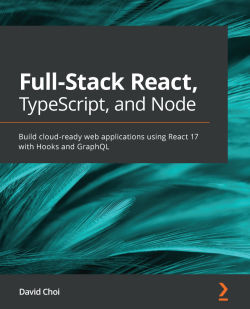

# Full-Stack React, TypeScript, and Node

# About this book

React sets the standard for building high-performance client-side web apps. Node.js is a scalable application server that is used in thousands of websites, while GraphQL is becoming the standard way for large websites to provide data and services to their users. Together, these technologies, when reinforced with the capabilities of TypeScript, provide a cutting-edge stack for complete web application development.

This book takes a hands-on approach to implementing modern web technologies and the associated methodologies for building full-stack apps. You’ll begin by gaining a strong understanding of TypeScript and how to use it to build high-quality web apps. The chapters that follow delve into client-side development with React using the new Hooks API and Redux. Next, you’ll get to grips with server-side development with Express, including authentication with Redis-based sessions and accessing databases with TypeORM. The book will then show you how to use Apollo GraphQL to build web services for your full-stack app. Later, you’ll learn how to build GraphQL schemas and integrate them with React using Hooks. Finally, you’ll focus on how to deploy your application onto an NGINX server using the AWS cloud.

By the end of this book, you’ll be able to build and deploy complete high-performance web applications using React, Node, and GraphQL.

# About the Author

## David Choi

David Choi is a developer with over 10 years' experience in building enterprise-class applications using a variety of frameworks and languages. Most of his professional development experience has involved working in finance for companies such as JPMorgan, CSFB, and Franklin Templeton. He currently works at his own start-up, DzHaven, building an application to help devs help other devs. You can find David on YouTube at the David Choi channel, or on Twitter at jsoneaday.